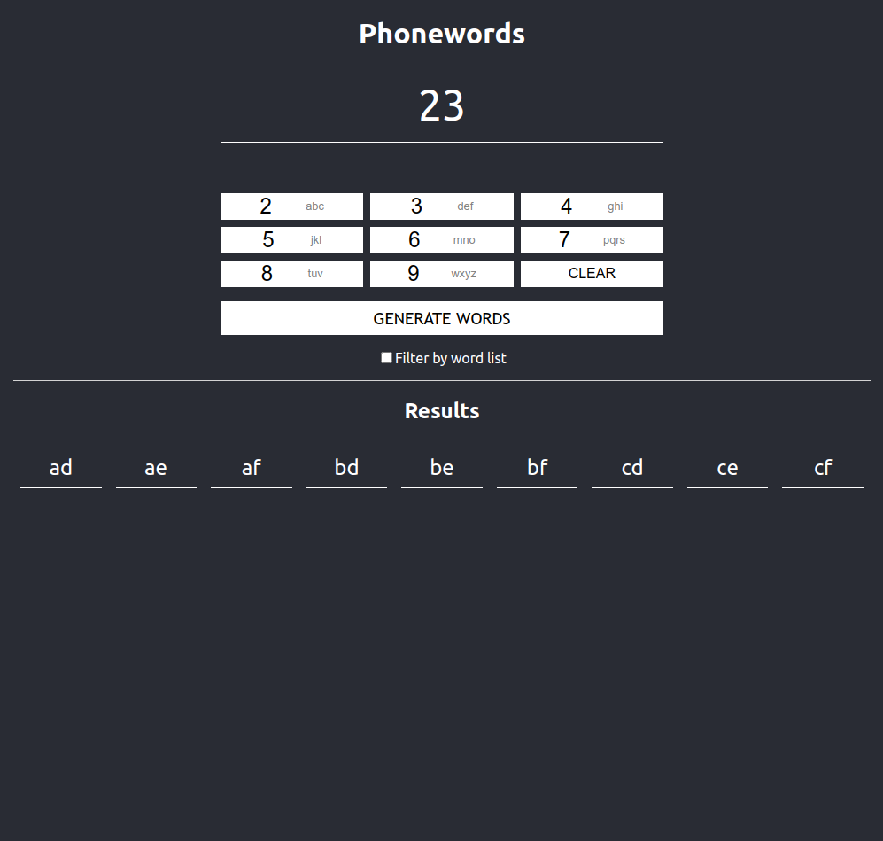

# Phonewords

This Node + React app takes a numeric string as an input and converts it to a list of possible [Phonewords](https://en.wikipedia.org/wiki/Phoneword)

## Installation

### Clone

```
git clone https://github.com/ewantindale/phonewords.git
cd phonewords
```

### Install and run Backend

```
cd backend
yarn
yarn dev
```

### Install and run Frontend

In a new terminal:

```
cd frontend
yarn
yarn dev
```

The app will now be running at http://localhost:3000

### Tests

Some backend tests are included

```
cd backend
yarn test
```


